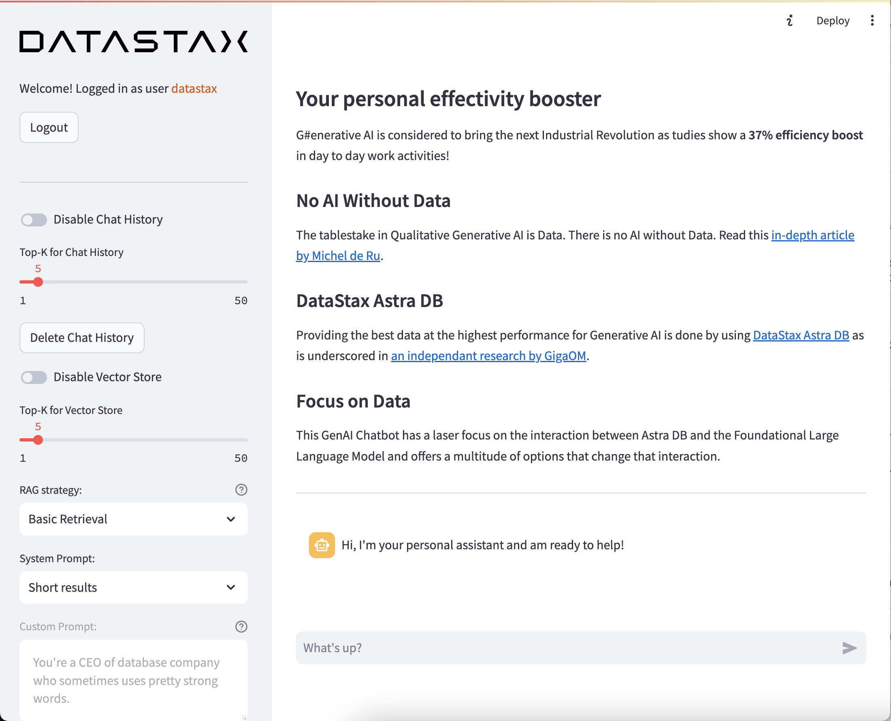
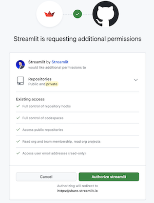

# GenAI RAG Chatbot
This Enterprise Sidekick is build specifically as a multi-tenant, reusable and configurable sample app to share with enterprises or prospects. It focusses on the interaction between the [Astra DB Vector Store](https://db.new) and the Foundational Large Language Model as *your* data is the only thing that provides a [*Sustainable Competitive Advantage*](https://datastax.medium.com/with-generative-ai-context-is-king-7a1469942044).



## Architecture

1. 🤩 It leverages [DataStax RAGStack](https://docs.datastax.com/en/ragstack/docs/index.html) for production-ready use of the following components:
    -  🚀 The [Astra DB Vector Store](https://db.new) for Semantic Similarity search to enable Retrieval Augmented Generation
    - 🧠 Short Term Memory through [Astra DB](https://db.new) to keep track of what was said and generated
    - 🦜🔗 [LangChain](https://www.langchain.com) for linking OpenAI and Astra DB
2. 👑 It uses [Streamlit](https://streamlit.io/) as the framework to easily create Web Applications

## Functionality
1. The Chatbot allows for new Content to be uploaded, Vectorized and Stored into the Astra DB Vector Database so it can be used as Context
    - Through PDFs and Text files
    - And through URLs, scraping web pages automatically
2. The Sidekick will turn pictures into relevant prompts
3. Integration with Langsmith for Tracing of queries, prompts and context from the Astra DB Vector Store
4. As there is **No AI Without Data** the Chatbot has a laserfocus on the integration of the Astra DB Vector Store with the OpenAI Chat Model with the following options:
    - Enable/Disable Chat Memory
    - Set Top-K for Chat Memory
    - Delete the Chat Memory at any given time
    - Enable/Disable the Vector Store
    - Set Top-K for the Vector Store
    - Select the following option as RAG strategy:
        - Basic Retrieval
        - Maximal Marginal Relevance
        - Fusion
    - Select from the following Promps:
        - Short results
        - Extended results
        - Use a Custom Prompt

3. It uses a StreamingCallbackHandler to stream output to the screen which prevents having to wait for the final answer

## Multi tenancy and customizations
Specifically for multi-tenancy and configurability the app offers:
1. A configurable localization through `/customizations/localization.csv` with default languages of us_US and nl_NL.
2. A guided experience on-rails through `/customizations/rails.csv`
3. A customizable `welcome page` in `/customizations/welcome` for a specific organization
4. A customizable logo in `/customizations/logo` for a specific organization

## 1️⃣ Preparations
This Chatbot assumes you have access to a [Github account](https://github.com).

And you need to gain access to the following by signing up for free:
1. [DataStax Astra DB](https://astra.datastax.com) (you can sign up through your Github account)
2. [OpenAI account](https://platform.openai.com/signup) (you can sign up through your Github account)
3. [Streamlit](https://streamlit.io) to deploy your amazing app (you can sign up through your Github account)

Follow the below steps and provide the **Astra DB API Endpoint**, **Astra DB ApplicationToken** and **OpenAI API Key** when required.

### Sign up for Astra DB
Make sure you have a **vector-enabled** Astra database (get one for free at [astra.datastax.com](https://astra.datastax.com))
- You will be asked to provide the **API Endpoint** which can be found in the right pane underneath *Database details*.
- Ensure you have an **Application Token** for your database which can be created in the right pane underneath *Database details*.

### Sign up for OpenAI
- Create an [OpenAI account](https://platform.openai.com/signup) or [sign in](https://platform.openai.com/login).
- Navigate to the [API key page](https://platform.openai.com/account/api-keys) and create a new **Secret Key**, optionally naming the key.
- You may need to provide credit card details and deploy a sum of money on your account. Especially in order to the the GPT4 model.

### Sign up for Streamlit
Follow the steps outlined [here](https://docs.streamlit.io/streamlit-community-cloud/get-started/quickstart).

### Install the Python dependencies
Install the Python dependencies using:
```
pip3 install -r requirements.txt
```

### Set up the secrets
Then update the `OpenAI`, `AstraDB` and optionally `LangSmith` secrets in `/.streamlit/secrets.toml`. There is an example provided at `secrets.toml.example`.


### Deploy your app

On the main screen, when logged in, click `New app`.

1. When this is your first deployment, provide additional permissions:

    

2. Now define your application settings. Use YOUR repository name, and make sure the Main file path is `streamlit_app.py`. Pick a cool App URL as you'll app will be deployed to that:


3. Click on Advanced, select `Python 3.11` and copy-paste the contents from your `secrets.toml` or define them here for the first time (see step 1).

Click Deploy! Wait for a bit and your app is online for everyone to use!

### ⛔️ Warning
 Be aware that this app is public and uses your OpenAI account which will incur cost. You'll want to shield it off by clicking `Settings->Sharing` in the main screen and define the email addresses that are allowed access. In order to enable this, link your Google account.

## Python environments
In case you want to run all of the above locally, it's useful to create a *Virtual Environment*. Use the below to set it up:
```
python3 -m venv myenv
```
Then activate it as follows:
```
# on Linux/Mac:
source myenv/bin/activate

# on Windows:
myenv\Scripts\activate.bat
```
Now you can start installing packages:
```
pip3 install -r requirements.txt
```
In order to check which packages have been installed:
```
pip3 freeze
```
Which you can save to requirements.txt if you want:
```
pip3 freeze > requirements.txt
```
